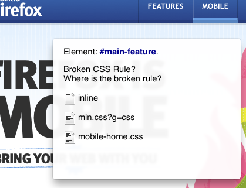
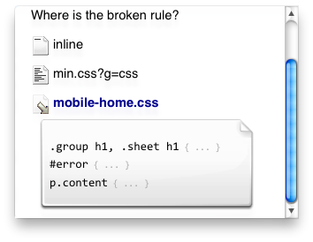
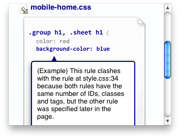

CSS Doctor
==========

Goal: To inform web developers why their page doesn't look the way they
expected, to inform them of solutions to the problem, and to help them avoid
the situation another time. In under 5 seconds.

Most web developer tools have a concept of an 'inspected element'. If we can
evaluate a selected CSS assignment (e.g. color=red) in the context of this
element, we can evaluate why the rule didn't work.

User Interface
--------------

The UI for selecting an element to inspect is well understood. There are
generally 3 methods:

- **direct**: either as a right-click menu item, or as a 'Inspect' action in
  the developer interface that requires a further click to select
- **html** tree: many developer interfaces include a tree view of the HTML,
  clicking on a node in this tree selects it for inspection
- **text**: Nodes can be specified through XPath and CSS expressions

This spec assumes that one or more of these methods already exists.

Rule selection works using a simple tree, beginning with the stylesheets in the
page:

Then allowing drill-down through rules to assignments:

On selection of an assignment, its status with respect to the inspected element
will be displayed.

Implementation
--------------

There are 2 basic cases where the computed style of an element isn't equal
to the an assignment in a CSS rule:

- Selector mismatch: A misspelled class name will probably cause an assignment
  to not be used. This is detected by testing the selectors in a selector group
  in turn. Existing UIs do this.
- Overriding and Low selector specificity: It is simple to score each CSS rule
  in a page to see which one wins. This knowledge can then be used to provide
  hints on how to fix the problem.
- Implementation details (a.k.a 'other'): There are a large number of one off
  cases to take account of. We will need to create a set of rules which we can
  run to test for each condition. For example:
  - the stylesheet is disabled
  - the media type does not match
  - sizing rules may be ignored for some display/position values

The biggest difficulty in completing this project will be in creating the rule
set to test for the 'other' case.

We have 2 excellent tools to leverage in creating this rule-set.

- Scalability. We can automatically find cases that we can't explain by having
  a test tool which tests explanations for all element/rule combinations on a
  page. The tool could automatically create bugzilla cases for unexplained
  failures. Writing rules, and explanations is easily scalable because there is
  generally zero overlap between 2 rules. We can ask the net for help.
- In house knowledge. We have already written code which obeys these rules. In
  some cases this code has been written several times. We also helped write the
  specs they implement.

